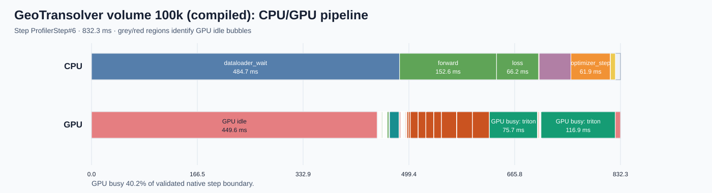
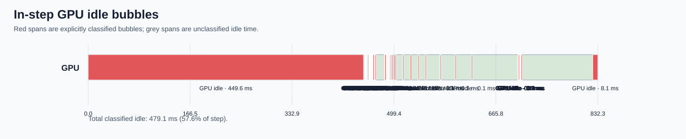
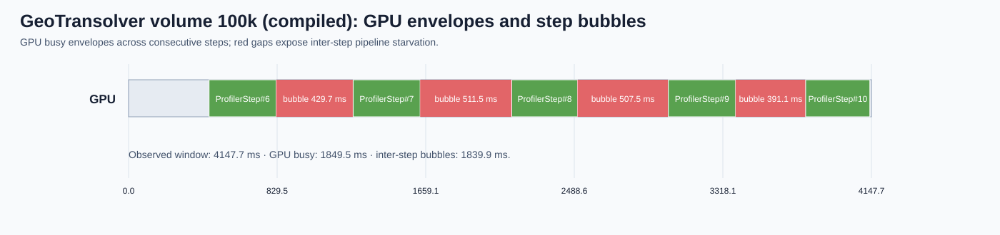
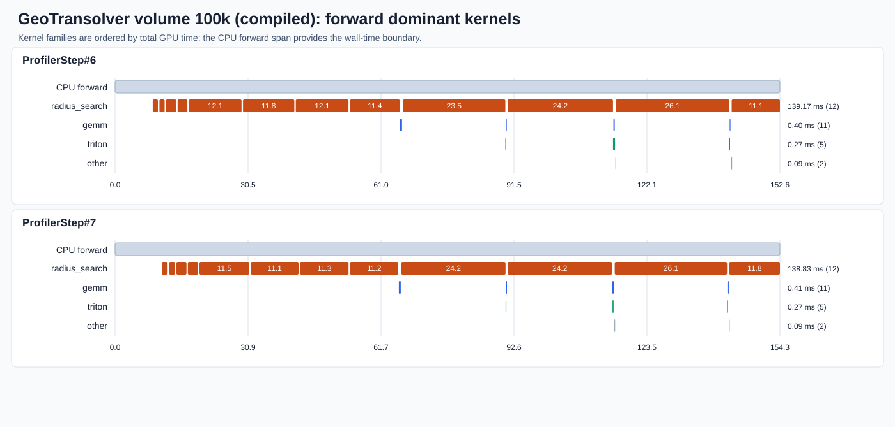

# GeoTransolver DrivAerML volume training at 100k points: performance analysis

_Phase 1: measurement, diagnosis, and routing only._  
_Run: `perf_geotransolver_volume_100k_20260731` · Date: `2026-07-31` · Commit: `02ede3694fa2f90003611a06c51dd15019575878`_

## Executive summary

On one H100 80GB, `torch.compile` reduced the unprofiled 100k-point steady-state step from 1,154.7 ms to 829.4 ms: a measured 1.392x speedup and 28.17% reduction. Correctness smoke checks passed. The estimated incremental cold compile cost was 82.86 s, which amortizes after roughly 255 steps.

The largest compiled residual is synchronous data preparation: `dataloader_wait` averaged 485.2 ms and HTA attributed 98% of GPU idle time to host wait. The compiled forward averaged 149.7 ms; 12 `radius_search` launches per step accounted for about 149.3 ms of GPU time. The intended 200k-point case did not fit on this GPU, failing at 77.51 GiB allocated while requesting another 684 MiB, so the 100k results must not be treated as proof of full-resolution viability.

No optimization was applied. Nsight Compute was explicitly skipped because the user stated it will not work on this system.

## Workload and protocol

| Item | Value |
|---|---|
| Entry point | `examples/cfd/external_aerodynamics/unified_external_aero_recipe/src/train.py` |
| Model/data | GeoTransolver volume; DrivAerML train split, 29 samples |
| Tested size | Batch 1, 100,000 sampled points, augmentation off |
| Precision | bfloat16 |
| Hardware | 1x NVIDIA H100 80GB HBM3, driver 570.195.03 |
| Runtime | PyTorch 2.13.0a0+8145d630e8.nv26.06, CUDA 13.3 |
| Data loader | 1 worker, prefetch factor 1, pinned memory, `use_streams=false` |
| Distributed | Single process/rank, GPU 0 |
| Baseline protocol | 5 warmup + 20 measured steps, 3 repetitions |
| Trace protocol | 5 active steps per eager/compiled trace |
| Timing boundary | After loss/metric host materialization, which synchronizes preceding CUDA work |
| Compile cache | Fresh isolated Inductor cache for every compiled baseline repetition |
| Confirmation | User-confirmed configuration fingerprint `90917e174c073f8e0a260e6e5197443f68deb31651351038fc304c11c9ba2114` |

Both variants used seed 42, deterministic shuffled ordering, identical logical workload settings, and profiler-disabled baseline timing. Validation and checkpoint work occurred outside the measured training-step window.

## Paired eager and compiled baseline

| Metric | Eager | Compiled | Delta |
|---|---:|---:|---:|
| Median of repetition means | 1,154.7 ms | 829.4 ms | -28.17% |
| Stdev of repetition means | 41.2 ms | 27.7 ms | — |
| Median throughput | 0.866 samples/s | 1.206 samples/s | +39.2% |
| Peak reserved GPU memory | 61.75 GiB | 38.74 GiB | -23.01 GiB |
| Profiled data wait mean | 435.0 ms | 485.2 ms | +50.2 ms |

Peak allocated memory was not emitted by the unprofiled logger; only peak reserved memory is reportable.

| Compilation item | Result |
|---|---:|
| Median compiled first step | 86,518.2 ms |
| Median eager first step | 3,661.4 ms |
| Estimated incremental compile overhead | 82,856.8 ms |
| Steady-state speedup | 1.392x |
| Estimated amortization | 254.7 steps |
| Classification | Beneficial |

The speedup uses only unprofiled post-warmup steps. Compiler diagnostic timing and profiler timing are excluded.

## Correctness

Both eager and compiled smoke runs produced finite losses and satisfied the velocity(3), pressure(1), and nut(1) shape contract. The paired loss checks passed `rtol=1e-2`, `atol=1e-3`:

| Step | Eager loss | Compiled loss | Relative difference |
|---:|---:|---:|---:|
| 1 | 0.1294633 | 0.1292384 | 0.1737% |
| 2 | 1.8138245 | 1.8106807 | 0.1733% |

## Paired traces and annotation health

The eager and compiled traces are `traces/eager/torch/trace.json` and `traces/compiled/torch/trace.json`. Both contain five native `ProfilerStep#N` boundaries and complete coverage for data wait, transfer, forward, loss, backward, optimizer, and synchronization. HTA user annotations were used directly; projected GPU annotation duplicates were excluded from CPU interval construction.

The compiled trace emitted the known warning that nested `record_function` annotations can be ignored by `torch.compile`. Required outer phase ranges were verified directly in the raw trace, so no recapture was required. All timestamps and durations were valid; no reconstructed boundaries were used.

## torch.compile diagnostics

| Diagnostic | Result |
|---|---:|
| Unique graph breaks / occurrences | 3 / 3 |
| Unique recompilation sites / occurrences | 3 / 6 |
| Cache-limit warnings | 0 |
| Eager fallback/backend marker | Present |

Graph breaks were logged at `physicsnemo/core/version_check.py:681`, `physicsnemo/optim/muon.py:277`, and PyTorch optimizer line 79. Recompilations occurred four times in `_batched_newton_schulz` at `physicsnemo/optim/muon.py:54`, once in `GeoTransolver.forward` at `geotransolver.py:605`, and once in the PyTorch optimizer wrapper. Guard reasons were not reported. These results come from a bounded diagnostic and are not benchmark timings.

## Whole-trace and phase analysis

| Variant | Compute | Non-compute | Idle | Host-wait share of idle |
|---|---:|---:|---:|---:|
| Eager | 64.08% | 0.14% | 35.78% | 96% |
| Compiled | 44.37% | 0.20% | 55.43% | 98% |

Compiled phase means:

| Phase | Mean wall time | Approx. step share |
|---|---:|---:|
| Data loader wait | 485.2 ms | 58.5% |
| Forward | 149.7 ms | 18.0% |
| Loss | 65.4 ms | 7.9% |
| Optimizer step, two spans combined | 62.4 ms | 7.5% |
| Backward | 50.1 ms | 6.0% |
| Distributed/host synchronization | 7.5 ms | 0.9% |
| Host-to-device | 0.043 ms | <0.1% |

HTA critical-path extraction succeeded on the middle `ProfilerStep#8`, with 491,457 us eager and 528,580 us compiled path weights. The raw traces lack CUDA synchronization events, so HTA warns these critical paths can be inaccurate. HTA also rounded sub-microsecond GPU events to -1 us; only those parser-generated negative rows were excluded from association tables, while raw traces remain unchanged.

## GPU kernel breakdown

| Compiled family | Calls over 5 steps | Total | Mean |
|---|---:|---:|---:|
| `radius_search` | 60 | 746.4 ms | 12.440 ms |
| Triton-generated | 7,124 | 472.0 ms | 0.066 ms |
| GEMM | 5,250 | 320.9 ms | 0.061 ms |
| BVH/SDF | 5 | 54.1 ms | 10.818 ms |
| Reduction | 575 | 6.9 ms | 0.012 ms |

The six configured geometric processors are traversed once for context features and again for local features, matching the observed 12 radius searches per step. NCU was not run, so no claim is made about the internal limiting mechanism of an individual radius-search kernel.

## CPU/GPU pipeline

### Eager

### Compiled

### Compiled in-step bubbles

### Compiled multi-step bubbles

The boundary in every diagram is a native profiler step. Compilation reduces model-side compute substantially, but synchronous preparation of the next sample leaves a larger visible GPU bubble and becomes the dominant end-to-end residual.

## Forward-pass dominant kernels

### Eager

### Compiled

Compilation replaces much eager framework/reduction work with Triton regions while leaving the external radius-search cost essentially unchanged: 751.8 ms eager versus 746.4 ms compiled over five steps.

## NCU kernel analysis

NCU capture was not run. A bounded `radius_search` plan was generated but never approved or executed; the user stated NCU will not work on this system. The decision is recorded in `ncu/skip.json`. HTA timing and source evidence support reducing duplicate neighborhood construction, but the kernel’s memory, occupancy, latency, or scanning limit remains unresolved.

## Phase-to-source map

| Phase | Main source | Coverage/result |
|---|---|---|
| Data wait | `train.py:361`; `physicsnemo/datapipes/dataloader.py:223`; `src/sdf.py:47` | Mapped; synchronous `_iter_simple` and transforms |
| Feature construction | `context_projector.py:573,730`; `mesh/spatial/sdf.py:940` | Mapped; repeated six-radius traversal |
| Host-to-device | `train.py:363`; `src/utils.py:331` | Mapped; negligible |
| Forward | `train.py:219`; `geotransolver.py:605`; `context_projector.py:1029` | Mapped; radius search dominates |
| Loss | `train.py:268`; `src/loss.py:134` | Mapped; intentional float32 metrics |
| Backward | `train.py:379` | Mapped |
| Optimizer | `train.py:379`; `src/utils.py:85`; `optim/muon.py:54` | Mapped; recompilations observed |
| Synchronization | `train.py:106,421` | Mapped; host metric materialization |
| Validation | `train.py:595,967` | Mapped outside timing window |
| Checkpoint | `train.py:1003` | Not applicable to bounded window |

## Ranked recommendations

| Priority | Finding | Evidence | Recommendation-only experiment |
|---:|---|---|---|
| 1 | Synchronous data preparation | 485.2 ms compiled data wait; 98% idle is host wait | Test existing stream-backed prefetch with sample order and transforms fixed |
| 2 | Duplicate neighborhood searches | 12 launches/step; 149.3 ms/step | Add an opt-in shared-neighborhood path and verify indices/features before timing |
| 3 | 200k memory pressure | OOM at 77.51 GiB allocated | Test one semantics-preserving checkpointing or tensor/domain sharding strategy |
| 4 | Compile cold cost and graph discontinuities | 82.86 s estimate; 3 breaks; 6 recompiles | Compare model-only versus model-plus-optimizer compile using fresh caches |

Suggested routing is respectively `physicsnemo-datapipe-adapter`, `physicsnemo-functionals-integrator`, `physicsnemo-shard-tensor-scaling`, and `torch-compile-diagnostic`. None of these optimizations has been implemented or measured in this phase.

## Limitations

- The intended 200k-point configuration OOMed before the first loss; this report characterizes a confirmed 100k-point fallback.
- Results are from one H100 and do not establish distributed scaling.
- Peak allocated memory is unavailable; only peak reserved memory was logged.
- HTA critical-path accuracy is limited by absent CUDA synchronization events and parser rounding of sub-microsecond events.
- NCU was explicitly skipped, leaving per-kernel limiting mechanisms unresolved.
- The repository was dirty before profiling; the manifest preserves the exact commit and worktree status.
- Throughput is based on a 29-sample manifest and a bounded 25-step epoch, not full-epoch training convergence.

## Artifact index

| Artifact | Purpose |
|---|---|
| `run-manifest.json`, `test-config.json`, `config-confirmation.json` | Reproducibility and confirmation contract |
| `baseline.json`, `baseline/summary.json`, `baseline/raw-steps.csv` | Unprofiled paired timing |
| `correctness.json`, `baseline/correctness.json` | Smoke parity |
| `compile-analysis.json`, `compile-comparison.json` | Compile diagnostics and conclusion |
| `annotation-health-eager.json`, `annotation-health-compiled.json` | Trace integrity |
| `traces/eager/`, `traces/compiled/` | Raw Kineto traces |
| `hta/eager/`, `hta/compiled/` | HTA tables and diagrams |
| `phase-source-map.json`, `source-analysis.json`, `findings.json` | Evidence-to-source diagnosis and routing |
| `ncu/skip.json` | Explicit NCU skip record |
| `logs/` | Smoke, baseline, profiling, and compiler logs |
