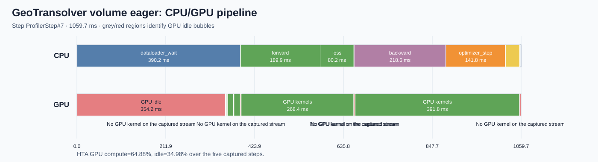
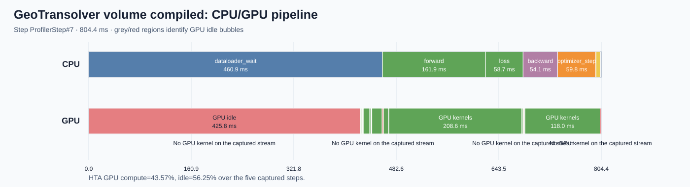
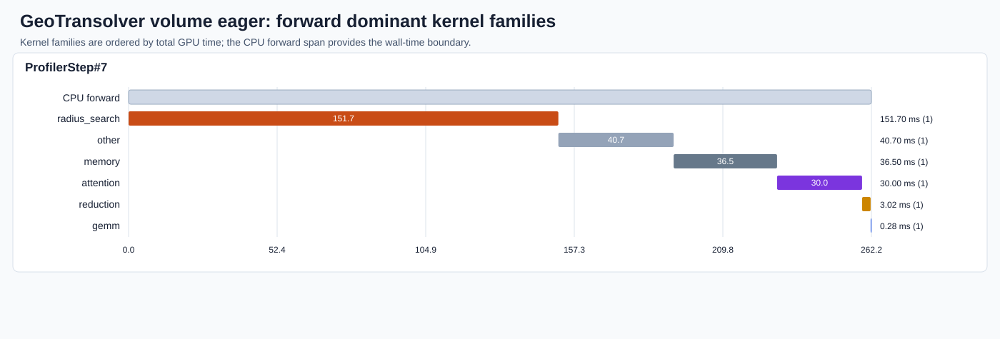
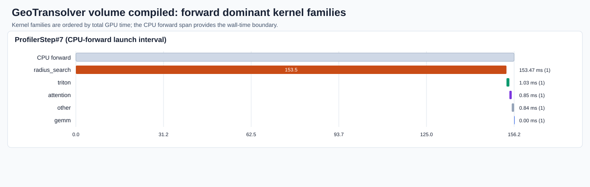

# GeoTransolver volume training performance analysis

_Phase 1: measurement, diagnosis, and routing only._  
Run: `geotransolver_volume_phase1_traces_v2_20260803` · Commit: `6778a9bc` (local profiling and dataset-path configuration present)

## Executive summary

On one H100 with bf16, 100K sampling, and batch size 1, `torch.compile` is beneficial: unprofiled median-of-repetition-means step time is **1089.7 ms eager** versus **809.0 ms compiled** (1.35× throughput). HTA shows compile reduces GPU compute but makes host wait and unchanged `radius_search` geometry work the residual bottlenecks. Findings are recommendation-only.

## Baseline and correctness

Three profiler-disabled repetitions used the same seed, data manifest, sampling resolution, precision, and one-GPU topology. Eager dispersion was 30.0 ms; compiled dispersion was 8.4 ms. Throughput is 0.918 versus 1.236 samples/s. Reserved memory was about 61.75 versus 38.70 GiB. Both variants completed with finite losses; final loss differed by 0.000085.

The first cold compiled smoke step was 83,448.9 ms; its estimated compile-only increment over eager is 78,846.4 ms, yielding an estimated 281-step amortization. These are separate from the steady-state comparison.

## Trace evidence

Both traces passed annotation health with five native `ProfilerStep` boundaries and all required phase ranges. HTA aggregate GPU compute was 3.316 s eager and 1.688 s compiled over five active steps. Idle rose from 34.98% to 56.25%; host wait accounted for 97% and 98% of idle respectively. Representative step #7 was 1,059.7 ms eager and 804.4 ms compiled.

## Compiler diagnostic

The diagnostic logged 3 unique graph breaks (3 occurrences), 3 unique recompilations (6 occurrences), and an eager-fallback/backend-failure indication. It includes Muon optimizer recompilations and one GeoTransolver forward recompilation; diagnostic timings were not used here.

## Findings and routing

- **H001 — host-side pipeline:** HTA shows host wait dominates idle; test prefetch/double buffering and SDF cache eligibility. Route: `physicsnemo-datapipe-adapter`.
- **H002 — residual geometry compute:** `radius_search` takes 153.469 ms in the representative compiled forward launch interval and remains visible across all five steps. Test one semantics-preserving reuse/deduplication experiment. Route: `physicsnemo-functionals-integrator`.

NCU was skipped: the next decisions are whether to eliminate/reuse repeated geometry work and overlap loading, not whether to tune a single kernel's occupancy or memory mechanism. No optimization was implemented.

## Limitations

- HTA critical-path analysis warned that the traces lack CUDA synchronization events; host-wait and kernel evidence remains usable, but critical-path attribution is qualified.
- Profile timings are diagnostic only; the reported speedup is solely from profiler-disabled repetitions.
- The compiled forward-kernel diagram uses kernels launched within the validated CPU `forward` interval because compiled trace projection omitted a GPU forward annotation; this provenance is recorded in `hta/compiled/analysis-metadata.json`.

## Artifact index

See `baseline.json`, `correctness.json`, `compile-analysis.json`, `findings.json`, `phase-source-map.json`, `source-analysis.json`, `hta/`, and `traces/`.
