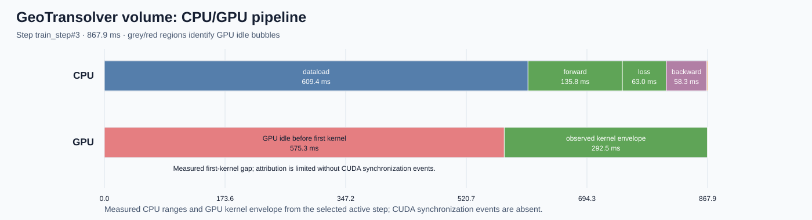
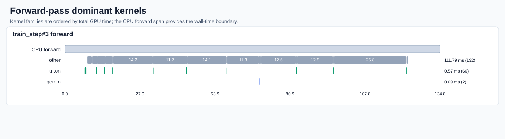

# GeoTransolver volume training performance analysis

_Phase 1: measurement, diagnosis, and routing only._  
_Run: `phase1_20260818T223226Z` · HTA 0.5.0_

## Executive summary

A bounded five-active-step profile now has `ProfilerStep` boundaries and HTA evidence. This report selects `ProfilerStep#3`, renders CPU/GPU and forward-kernel diagrams, and records a single **recommendation-only** investigation: test DataLoader configuration changes. It does not apply an optimization or claim a speedup. The additional two baseline repetitions were explicitly waived for this workflow run.

## Model and workload

| Item | Value |
|---|---|
| Entry point | `examples/cfd/external_aerodynamics/unified_external_aero_recipe` |
| Launch command | `python src/train.py model=geotransolver_volume dataset=drivaer_ml_volume profile=false +v0_result=true compile=true precision=bfloat16 sampling_resolution=100000 training.seed=42 training.batch_size=1 training.num_epochs=1 run_id=bench_geotransolver_volume_100k` |
| Model/config | GeoTransolver volume / `geotransolver_volume.yaml` |
| Dataset/sample | DrivAer volume, 100k sampled points |
| Precision/compile | bf16, compiled |
| Distributed strategy | single-rank selected trace |

## Benchmark protocol

| Item | Value |
|---|---|
| Warmup/profile schedule | 1 wait, 1 warmup, 5 active profiler steps |
| Unprofiled repetitions | 1 (two additional repetitions waived by user) |
| Correctness signal | `validation_loss` |
| Performance goal | minimize representative unprofiled step time |

## Baseline performance

| Metric | Value | Unit |
|---|---:|---|
| Step time | 832.372 | ms |
| Correctness value | 0.076905847 | `validation_loss` |
| Selected trace step | 867.890 | ms |

## Traces and whole-trace temporal breakdown

Trace input: `/mymount/ramu-data/repos/physicsnemo/simplified/outputs/runs/analyze-geotransolver-volume-2/artifacts/trace-38cb884af762.json`. The copied Kineto trace, HTA logs, tables, and graph archive are retained in this bundle.

| rank | idle time (us) | compute time (us) | non-compute time (us) | kernel time (us) | idle % | compute % | non-compute % |
| --- | --- | --- | --- | --- | --- | --- | --- |
| 0 | 22326687.0 | 5192986.0 | 128483.0 | 27648156.0 | 80.75 | 18.78 | 0.46 |

## Per-step phase decomposition

| Phase | CPU wall time | GPU busy | Idle | Step share | Evidence |
|---|---:|---:|---:|---:|---|
| forward | 135.791 ms | — | — | 15.6% | `hta/diagram-data.json` |
| loss | 62.968 ms | — | — | 7.3% | `hta/diagram-data.json` |
| backward | 58.336 ms | — | — | 6.7% | `hta/diagram-data.json` |
| optimizer | 1.170 ms | — | — | 0.1% | `hta/diagram-data.json` |
| dataload | 609.370 ms | — | — | 70.2% | `hta/diagram-data.json` |

## Critical path

HTA completed a critical-path graph for `ProfilerStep#3` with 0 breakdown rows. CPU-bound contribution is 0.00% and GPU-compute-bound contribution is 0.00%. The evidence is in `hta/critical-path-breakdown.json`, `hta/critical-path-summary.json`, and `hta/critical-path-graph.zip`.

**Caveat:** Trace lacks CUDA synchronization events; HTA reports that critical-path attribution may be inaccurate.

## Key finding: data-wait investigation

The selected step’s largest annotated CPU span is `dataloader_wait`. HTA also reports substantial idle time. This supports an isolated DataLoader configuration experiment, but the missing CUDA synchronization events lower confidence in exact critical-path attribution. No implementation is included here.

## GPU kernel breakdown

| Kernel type | total duration | percentage |
|---|---:|---:|
| COMPUTATION | 5192939 | 97.6 |
| MEMORY | 129121 | 2.4 |
| COMPUTATION overlapping MEMORY | 48 | 0.0 |

## Dominant GPU operations in the selected step

| Phase | Kernel operation | Calls | Total GPU time (us) | Mean GPU time (us) | Step wall-time ratio |
|---|---|---:|---:|---:|---:|
| `forward` | `radius_search_limited_select_batched_2985e173_cuda_kernel_forward` | 11 | 110673.109 | 10061.192 | 12.752% |
| `loss` | `radius_search_limited_select_batched_2985e173_cuda_kernel_forward` | 1 | 26402.984 | 26402.984 | 3.042% |
| `dataloader_wait` | `_nearest_triangle_kernel` | 1 | 10127.274 | 10127.274 | 1.167% |
| `backward` | `triton_poi_fused__softmax_backward_data__to_copy_add_div_expand_permute_squeeze_unsqueeze_view_2` | 9 | 7427.664 | 825.296 | 0.856% |
| `backward` | `triton_red_fused__softmax_backward_data__to_copy_clamp_div_27` | 9 | 5983.667 | 664.852 | 0.689% |
| `loss` | `nvjet_sm90_tst_112x128_64x7_2x1_v_bz_bias_TNN` | 48 | 5943.601 | 123.825 | 0.685% |
| `loss` | `triton_poi_fused__softmax__to_copy_add_clamp_div_ge_mul_neg_permute_scalar_tensor_sub_transpose_` | 19 | 5576.980 | 293.525 | 0.643% |
| `loss` | `triton_per_fused__softmax__to_copy_amax_clamp_mul_sub_view_46` | 18 | 5385.814 | 299.212 | 0.621% |
| `loss` | `triton_poi_fused__to_copy_add_div_permute_unsqueeze_48` | 18 | 5151.352 | 286.186 | 0.594% |
| `backward` | `nvjet_sm90_tst_256x160_64x4_1x2_h_bz_coopA_NNT` | 18 | 4351.572 | 241.754 | 0.501% |
| `loss` | `nvjet_sm90_tst_128x256_64x4_2x1_v_bz_coopA_bias_TNN` | 19 | 4316.536 | 227.186 | 0.497% |
| `backward` | `triton_poi_fused__softmax__to_copy_clamp_mul_sub_view_25` | 9 | 3707.577 | 411.953 | 0.427% |

The phase is the annotated CPU range with the largest timestamp overlap. GPU times are summed kernel durations, so concurrent CUDA streams can make their total exceed the selected step wall time. Critical-path contribution is not shown because this table is timestamp-based; this run has no HTA critical-path breakdown to join against. The complete data is in `hta/dominant-gpu-kernels.json`.

## CPU/GPU step pipeline

The diagram uses `train_step#3` and measured trace timestamps relative to that boundary. It distinguishes the annotated CPU ranges from the observed GPU-kernel envelope; bubble annotations are not a claim of causal attribution.

## Forward-pass dominant kernels

Kernel families are normalized directly from `cat=kernel` events within the CPU forward boundary. The normalized input and diagram manifest are retained under `hta/`.

## NCU kernel analysis

NCU was not run: the current evidence points first to a host/data pipeline investigation, and critical-path attribution has the CUDA-synchronization limitation above. NCU remains a conditional phase-2 drill-down after a GPU kernel is selected.

## Phase-to-source map and code analysis

`phase-source-map.json` maps every canonical phase. `source-analysis.json` records exact source anchors, observed behavior, and the recommendation-only phase-2 experiment. Feature construction, distributed synchronization, validation, and checkpointing are explicitly not applicable to independently attributed work in this bounded training-only selected step.

## Ranked hotspots and routing

| Priority | Hotspot | Confidence | Proposed isolated experiment |
|---:|---|---|---|
| 1 | `dataloader_wait` | medium | DataLoader workers/prefetch/pinned-memory configuration A/B |

Route: `physicsnemo-training-performance-tuner`. Re-run the existing correctness signal and profiler-disabled baseline before assessing performance.

## Correctness

The original baseline correctness observation passed: `validation_loss = 0.076905847`. Any phase-2 experiment must preserve it within the configured tolerance.

## Limitations and caveats

- Only one unprofiled baseline repetition is present; the user waived the two additional repetitions normally required by the phase-1 protocol.
- Trace lacks CUDA synchronization events; HTA reports that critical-path attribution may be inaccurate.
- This phase-1 artifact contains recommendations only; it contains no applied change or measured speedup.

## Artifact index

| Artifact | Purpose |
|---|---|
| `run-manifest.json` | Reproducibility contract and explicit baseline waiver |
| `baseline.json` | Single unprofiled measurement and waiver metadata |
| `findings.json` | Ranked recommendation-only hotspot |
| `phase-source-map.json` | Trace-phase to source/config mapping |
| `source-analysis.json` | Code observation and isolated phase-2 plan |
| `hta/dominant-gpu-kernels.json` | Phase-labeled dominant GPU-operation accounting for the selected step |
| `hta/` | HTA tables, critical path, normalized diagram data, and SVGs |
